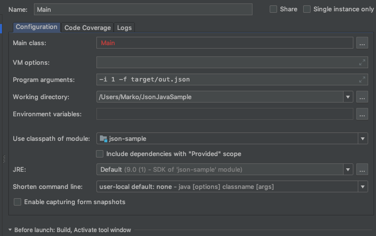

# JsonJavaSample

Rudimentary implementation of Serializing/Deserializing JSON to a sample Java object and vice versa. The current implementation only allows writing/reading to a file.

# Getting Started

The program requires 2 parameters: 

`1: -i {binary value: 0 write JSON to file or 1 read the json to the Java model}`

`2: -f {path-to-json-file}`

# Sample Configuration

Save yourself some headache and dont try to compile and run via CLI. Use Intellij/Eclipse

NOTE: If you run into compiliation troubles make sure you are importing all maven dependencies, change the project SDK for Intellij `File -> Project Structure -> Project/Modules/SDKs` are all set to use Java 9.
